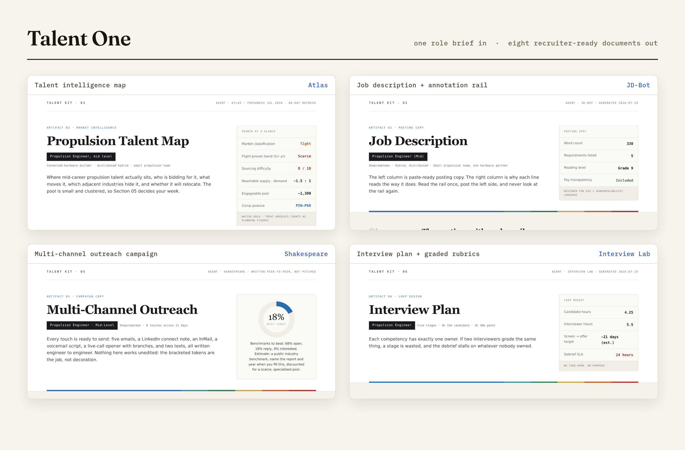
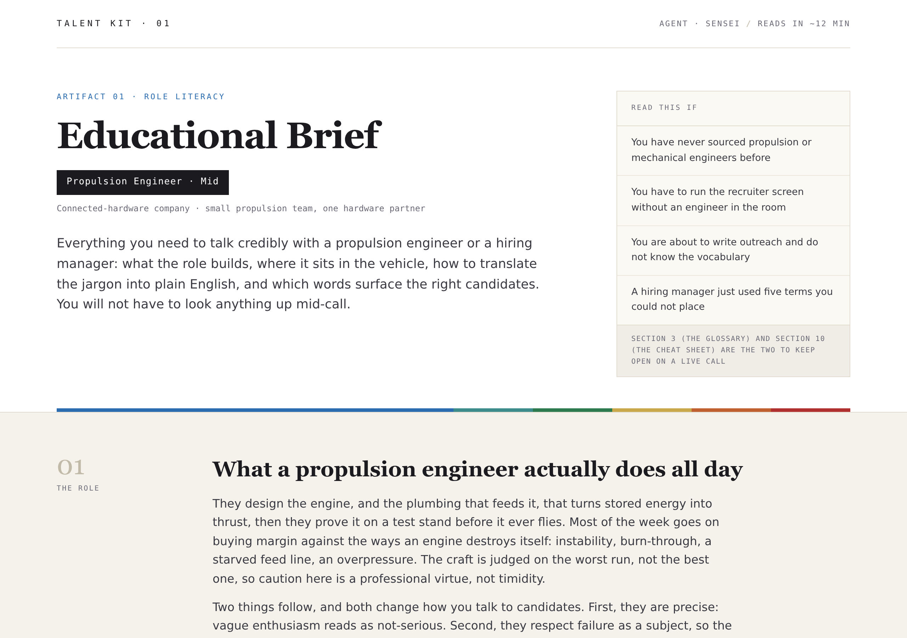
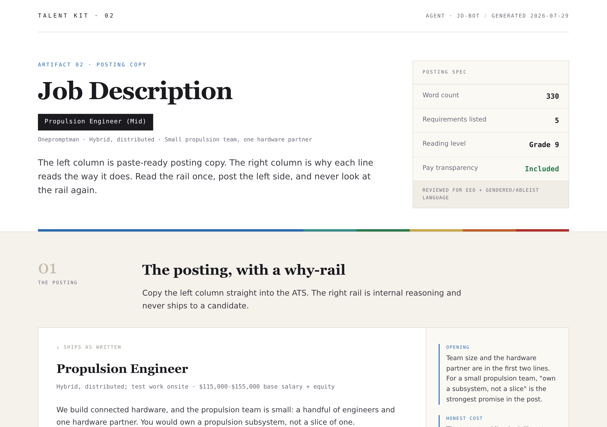
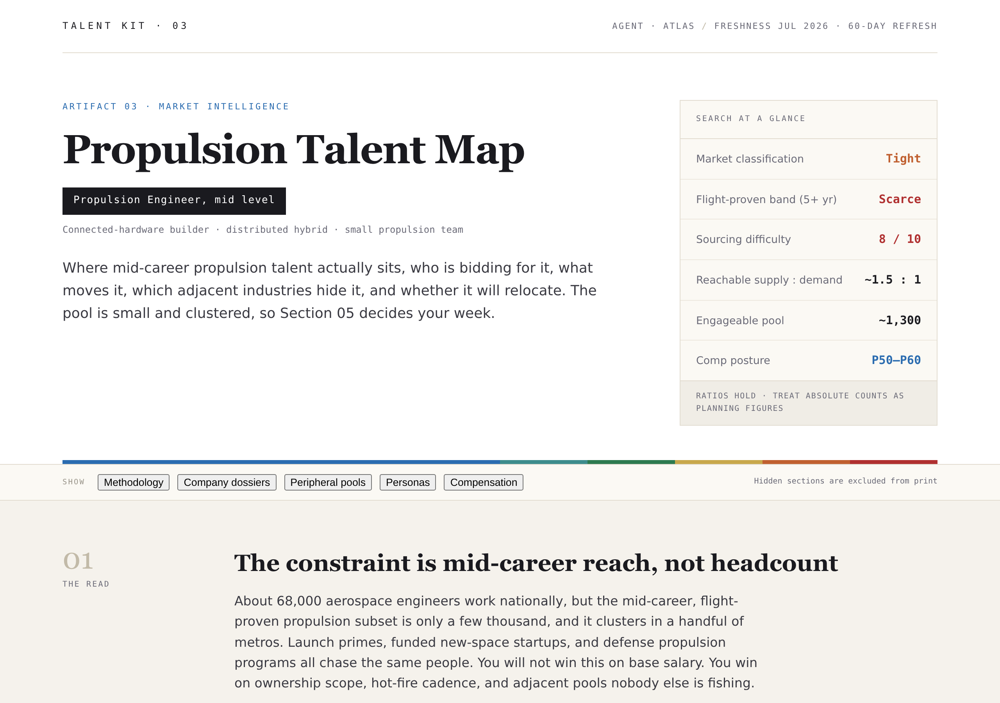
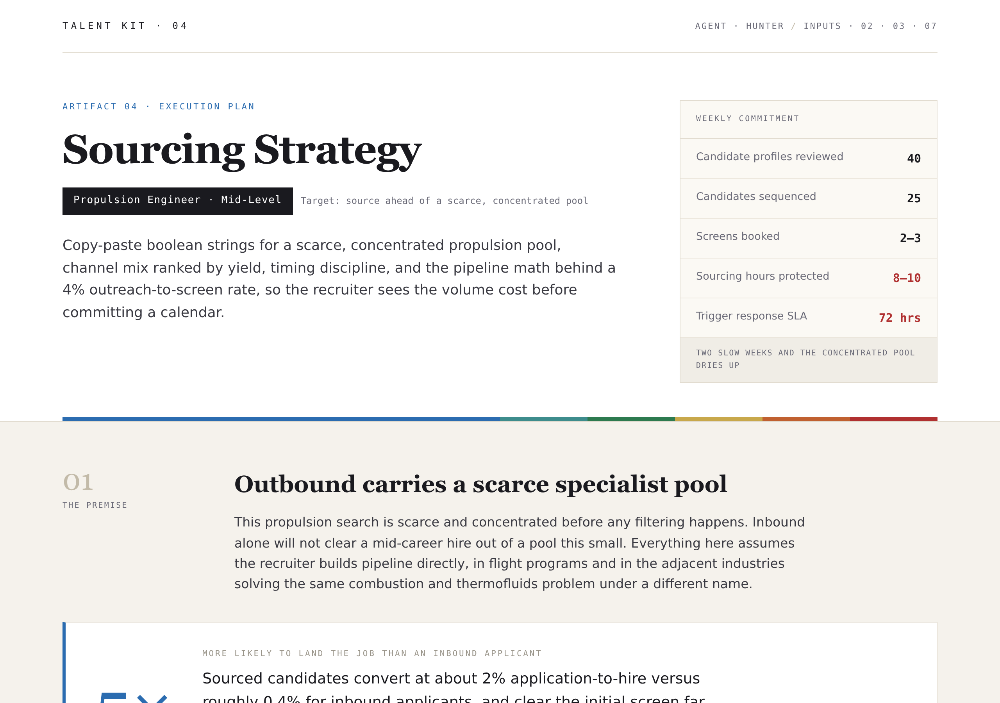
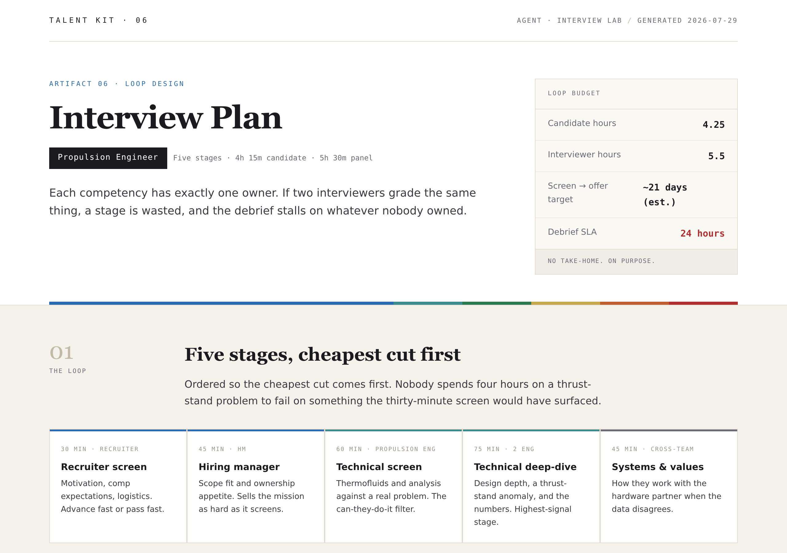
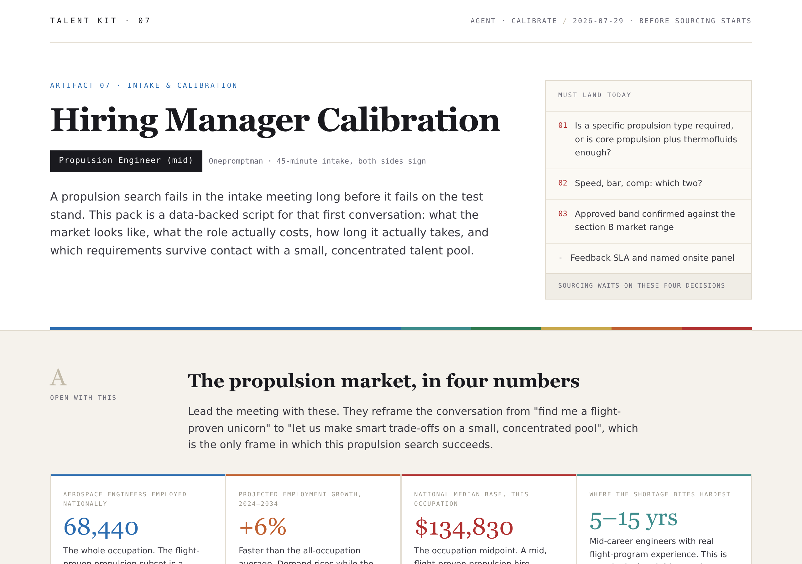
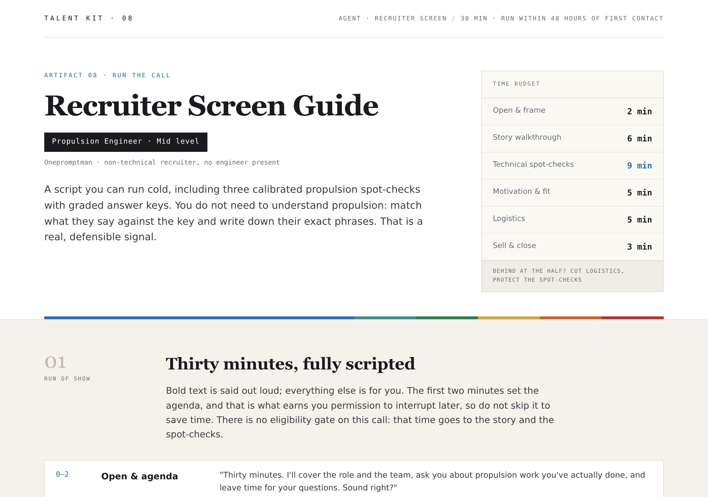

<div align="center">

# Talent One

**Eleven coordinated talent-acquisition agents. One role brief in, a full eight-document hiring package out.**

[](CHANGELOG.md)
[](#where-it-runs)
[](LICENSE.md)

by [Onepromptman](https://github.com/onepromptman) · © 2026

</div>



---

> ### ⚠️ Where it runs
>
> Talent One runs in **Claude Code** and **Cowork** (the Claude desktop app).
>
> It does **not** run in the regular Claude chat window. Chat cannot spawn the kit's eleven sub-agents, so `set up talent one` will do nothing there. If nothing happens when you try it, you're in the wrong surface.

---

## Install

**Option A — marketplace (recommended, two lines):**

```
/plugin marketplace add onepromptman/talent-one
/plugin install talent-one@onepromptman
```

**Option B — download the build:** grab [`dist/talent-one-1.0.3.plugin`](dist/talent-one-1.0.3.plugin) (or the file attached to the [latest release](../../releases/latest)) and add it as a plugin in Claude Code or Cowork.

Then, once:

```
set up talent one
```

Five questions about your company, every one with a default and a skip. About five minutes.

Then just ask, in plain words:

| You say | You get |
| --- | --- |
| `Run Talent One for a Senior ML Engineer` | The full eight-document kit — research and QA included, ~30 min |
| `Write me a JD for a staff accountant` | One document, minutes |
| `Update the comp band to $180k–$220k` | Re-rendered in about a second |

## What it makes

| # | Artifact | Agent | Sample |
| --- | --- | --- | --- |
| 01 | Role educational brief (for non-technical recruiters) | Sensei | [view](samples/01_Role_Educational_Brief_SAMPLE.html) |
| 02 | Job description with annotation rail | JD-Bot | [view](samples/02_Job_Description_SAMPLE.html) |
| 03 | Talent intelligence map — supply, demand, geo, comp | Atlas | [view](samples/03_Talent_Intelligence_Map_SAMPLE.html) |
| 04 | Sourcing playbook with tiered boolean library | Hunter | [view](samples/04_Sourcing_Playbook_SAMPLE.html) |
| 05 | 8-touch multi-channel outreach campaign | Shakespeare | [view](samples/05_Outreach_Campaign_SAMPLE.html) |
| 06 | Interview plan with graded rubrics | Interview Lab | [view](samples/06_Interview_Plan_SAMPLE.html) |
| 07 | Hiring-manager calibration brief | Calibrate | [view](samples/07_HM_Calibration_Brief_SAMPLE.html) |
| 08 | 30-minute recruiter screen script | Recruiter Screen | [view](samples/08_Recruiter_Screen_Script_SAMPLE.html) |
| — | QA audit of the whole package | QA Gate | — |

**Relay** (plans the run) and **Scout** (builds the shared per-role research pack) run automatically behind every artifact above. You never invoke them directly.

Every artifact is a polished, self-contained HTML document — zero network requests, opens anywhere. Every number carries a provenance pill: **Sourced**, **Estimate**, or **Internal**. Nothing is fabricated; gaps are labeled, never filled with filler.

### Sample gallery

Eight real documents from one `Propulsion Engineer` run (a fictional company, public labor-market data). Click any preview to open the full interactive HTML.

<table>
<tr>
<td width="50%"><a href="samples/01_Role_Educational_Brief_SAMPLE.html"></a><br><sub><b>01 · Role educational brief</b> — Sensei</sub></td>
<td width="50%"><a href="samples/02_Job_Description_SAMPLE.html"></a><br><sub><b>02 · Job description + annotation rail</b> — JD-Bot</sub></td>
</tr>
<tr>
<td width="50%"><a href="samples/03_Talent_Intelligence_Map_SAMPLE.html"></a><br><sub><b>03 · Talent intelligence map</b> — Atlas</sub></td>
<td width="50%"><a href="samples/04_Sourcing_Playbook_SAMPLE.html"></a><br><sub><b>04 · Sourcing playbook</b> — Hunter</sub></td>
</tr>
<tr>
<td width="50%"><a href="samples/05_Outreach_Campaign_SAMPLE.html"></a><br><sub><b>05 · Multi-channel outreach campaign</b> — Shakespeare</sub></td>
<td width="50%"><a href="samples/06_Interview_Plan_SAMPLE.html"></a><br><sub><b>06 · Interview plan + graded rubrics</b> — Interview Lab</sub></td>
</tr>
<tr>
<td width="50%"><a href="samples/07_HM_Calibration_Brief_SAMPLE.html"></a><br><sub><b>07 · Hiring-manager calibration brief</b> — Calibrate</sub></td>
<td width="50%"><a href="samples/08_Recruiter_Screen_Script_SAMPLE.html"></a><br><sub><b>08 · Recruiter screen script</b> — Recruiter Screen</sub></td>
</tr>
</table>

> Previews are screenshots. Each links to the full self-contained HTML — open it in a browser for the live document (GitHub shows `.html` as source, so use the raw/download view or clone the repo).

## How it works

One research pass per role builds a **Context Pack** — market classification, one canonical comp range, requirements, keywords, personas, channels, targets, timing, each value carrying its provenance.

Then every requested artifact agent runs **in parallel** against that pack, emitting content only. A deterministic renderer fills the templates, so no finished document ever passes through a model and the geometry is always right. The QA gate audits content against the pack before anything is called done.

```
role brief ──▶ Relay (plan) ──▶ Scout (one research pass ──▶ Context Pack)
                                          │
                    ┌─────────────────────┼─────────────────────┐
                    ▼                     ▼                     ▼
                 Sensei · JD-Bot · Atlas · Hunter · Shakespeare ·
                 Interview Lab · Calibrate · Recruiter Screen     (parallel)
                    └─────────────────────┬─────────────────────┘
                                          ▼
                        deterministic renderer ──▶ QA Gate ──▶ 8 HTML documents
```

**Timing:** full kit ≈ 30 minutes cold (measured live). One artifact on a warm role: minutes. Changing a number later re-renders in seconds.

Anything you already hold — a JD, intake notes, comp data, a brain dump — shortens the pack build. A paste-ready deep-research prompt (`skills/talent-one/references/PACK_RESEARCH_PROMPT.md`) lets you build the pack in any Claude chat and hand it in as a file.

## Data and connectors

Works with **zero connections**, using public data: BLS, O\*NET, Census, DOL disclosure data, levels.fyi, live web search. That is a fully supported path, not a degraded mode.

Connecting your ATS or document store upgrades specific agents — see [CONNECTORS.md](CONNECTORS.md).

Constraints (work authorization, clearance, licensure) are recruiter-written, rendered verbatim, and never invented. An empty constraints list ships no eligibility gate at all.

## Is it safe to install?

The plugin is plain text: prompts, templates, and two small scripts that only run inside Claude's sandbox. No executables, nothing installs on your computer, nothing reports back to anyone. The whole source is in this repo — read it.

Verify your download is the official build:

```bash
sha256sum talent-one-1.0.3.plugin
# ca7f3c207ab89cce313b6c5c47b92aaeee45794e402aeac74eb2823e934ab88b
```

## Repository layout

```
.claude-plugin/     plugin.json + marketplace.json
agents/             the 11 agent definitions
skills/             11 skills — the full kit plus one per artifact
samples/            all 8 documents from the built-in worked example
docs/               quickstart PDF, one-pager PDF, release notes
dist/               packaged .plugin build
```

## Docs

- [Quickstart (PDF)](docs/TalentOne_Quickstart.pdf) — 3 pages: what it is, how it works, setup
- [One-pager (PDF)](docs/TalentOne_OnePager.pdf)
- [Install guide](docs/INSTALL.md) — per-surface steps for Claude Code and Cowork
- [Release notes 1.0.3](docs/RELEASE_NOTES_1.0.3.md) · [Changelog](CHANGELOG.md)
- [Connectors](CONNECTORS.md)

## License

Source-available, not open source. You may install it, run it for your own org or your clients, customize it, and use or publish every artifact it generates — those are yours. You may not resell or redistribute the kit itself. Full terms in [LICENSE.md](LICENSE.md).

Artifacts are drafts for professional review. Nothing the kit produces is legal advice; compensation, eligibility, and compliance language must be reviewed by the people responsible for those decisions at your organization.

---

Questions, bugs, or want a kit run on a live role? Open an issue, or find **Bryan (Onepromptman)** on LinkedIn.
